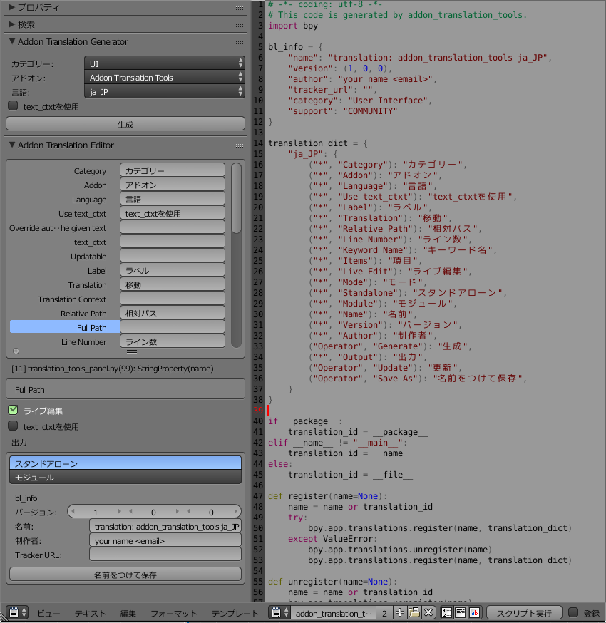

# addon_translation_tools

`adoon_translation_tools`はBlenderアドオンを翻訳/国際化するためのアドオンです。
アドオンのソースコードから構文解析により翻訳可能な文字列を抽出し、Blender上で翻訳できます。
翻訳結果は、単体で動作するアドオンもしくは、アドンに組み込み可能なPythonモジュールとして出力できます。

## UI

`adoon_translation_tools`のパネルはテキストエディターにあります。

### Addon Translation Generator

Blenderアドオンのソースコードから翻訳対象を抽出し、編集できるようにします。

#### カテゴリー

対象アドオンのカテゴリーを選択/フィルタします。

#### アドオン

対象アドオンを選択します。

#### 言語

翻訳対象の言語を選択します。日本語の場合`ja_JP`を選択します。

#### text_ctxを使用

翻訳コンテキストを使用する場合に指定します。これはアドオン側が対応していないと使用することはできません。一般的には使用しません。

#### 生成

Blenderアドオンのソースコードから翻訳対象を抽出し、編集できるようにします。実行すると下に`Addon Translation Editor`が表示されます。

### Addon Translation Editor

翻訳作業を行います。

#### 翻訳リスト

右のラベルを左の文字列に翻訳します。
ラベルを選択すると、ソースコード上での行数、使われている文脈、全文(長い場合)を下のパネルに表示します。

#### ライブ編集

チェックを付けると、翻訳や設定の変更がリアルタイムで反映されます。

#### text_ctxを使用

翻訳コンテキストを使用する場合に指定します。これはアドオン側が対応していないと使用することはできません。一般的には使用しません。

#### 出力

出力の設定を行います。

##### スタンドアローン/モジュール

単体で動作する翻訳アドオンを作成する場合は、`スタンドアローン`を選択します。既存のアドオンに組み込むPythonモジュールを作成する場合は、`モジュール`を選択します。

##### bl_info

単体で動作するアドオンを作成する場合のアドオン情報を入力します。

##### 更新

ライブ編集がOFFの場合に表示されます。更新ボタンをクリックすると翻訳や設定が反映されます。

##### 名前を付けて保存

作成したアドオン/モジュールをファイルに保存します。

## 翻訳作業

`Addon Translation Editor`での作業内容は、blendファイルに保存されます。作業はひとつのblendファイルを使って行います。

作成したアドオン/モジュールから作業を復元したい場合は、テキストエディタで対象のファイルを読み込んでから`スクリプト実行`を行った後で、`Addon Translation Generator`からもう一度生成してください。`Addon Translation Generator`は利用可能な翻訳があれば、それを使って翻訳情報を生成します。

### 制限と注意事項

翻訳を行った単語は、Blender全てに適用されます。Blender本体や他のアドオンにも適用されます。元の単語より詳細な翻訳を付けないようにしてください。またすでに翻訳の存在する単語は上書きできません。

text_ctxtを使う場合、指定したコンテキストでのみ翻訳が行われますが、アドオン側の対応が必要になります。

## 作成した翻訳アドオンの使用

作成した翻訳アドオンは、通常のBlenderアドオンと同じように`ユーザー設定 > アドオン > ファイルからアドオンをインストール`でインストールできます。カテゴリは`User Interface(UI)`になっています。チェックを付けて有効にします。

作成した翻訳アドオンのテストは、クリーンなblendファイルで行ってください。翻訳作業で使用しているblendファイルは作業中の翻訳情報を適用するため、作成したアドオンの翻訳は適用されていない可能性があります。

## 作成した翻訳モジュールの使用

作成した翻訳モジュールは、アドオンからimportして使用します。
アドオンの`register()`で翻訳モジュールの`register()`を実行し、アドオンの`unregister()`で翻訳モジュールの`unregister()`を実行します。
このアドオンの[__init.py](__init__.py)を参照してください。
